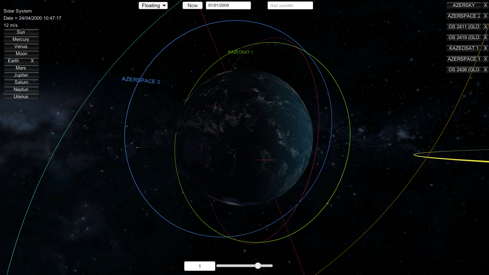
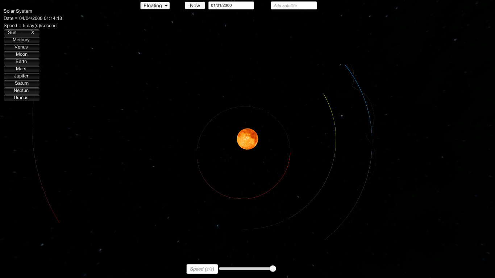

# Solar System Model

It is accurate model of Solar System, built with JPL Horizons data and syncronized with real Solar System objects. 	The least accurate part is sizes: for distances scale is 66,666 km : 1 unit, for planet sizes - 640 km : 1 unit

## Screenshots

## Controls
- Common keys:
    - F4/F5 - Change between the cameras
    - Slider - change speed of time
    - InputField at the top - change date (format "dd/MM/yyyy" , e.g. "02/09/2000")
    - Floating Camera (attached to the objects):
    - W,S,A,D - move around object
    - Mouse + Right_Button - move around object
    - R - reset camera position and rotation
    - PageUp/PageDown - move to the next/previous planet(object)
    - Mouse ScrollWheel - zoom
- Main Camera (attached to the Sun):
    - W,S,A,D - move around the sun
    - R - reset camera position
    - Mouse ScrollWheel - zoom
- Free Camera:
    - W,S - move forward the object
    - A,D - turn left/right
    - Q,Z - turn up/down

## Getting Started

### Prerequisites

You will need Unity to install and work with project.

### Installing

Download repository and open as Unity project

Built With: Unity - game engine

